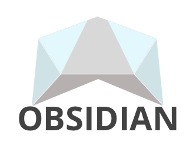
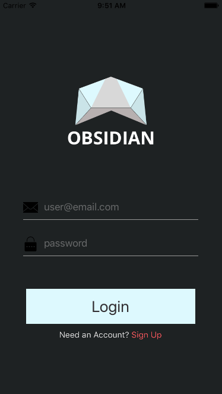
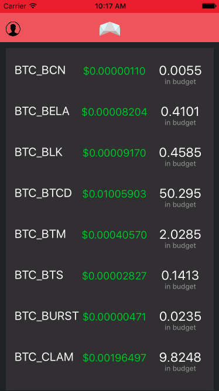
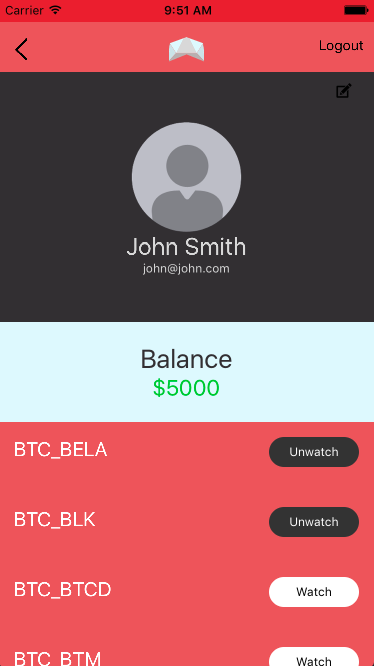

# Welcome To Obidian Readme!

Obsidian is a Cryptocurrency exchange tracker and soon will be a fully integrated portfolio

# Screenshots

# Technologies
1. React Native
2. Node
3. Express
4. Firebase
5. Kraken API

# Approach

The project was initially started by designing and creating wireframes. This not only helped drive the styling but helped define the components that would need to be made in react. Then I moved into a proof of concept by generating some api calls from some cryptocurrency exchanges. Once this was accomplished I began testing some helloworld React Native apps.

Then development of some mockups in React Native began. Once these were completed I integrated the api data to the frontend and had a working prototype.

From there I started working on the profile screen and authentication functionality.

# Installation
1. Install react-native-cli
2. fork and clone
3. npm install
4. react-native run-ios

# User Stories
### [Trello](https://trello.com/b/rTppVKwm/project-4)

An embedded screenshot of the app
Explanations of the technologies used
A couple paragraphs about the general approach you took
Installation instructions for any dependencies
Link to your user stories – who are your users, what do they want, and why?
Link to your wireframes – sketches of major views / interfaces in your application
Link to your pitch deck – documentation of your wireframes, user stories, and proposed architecture
Descriptions of any unsolved problems or major hurdles you had to overcome
